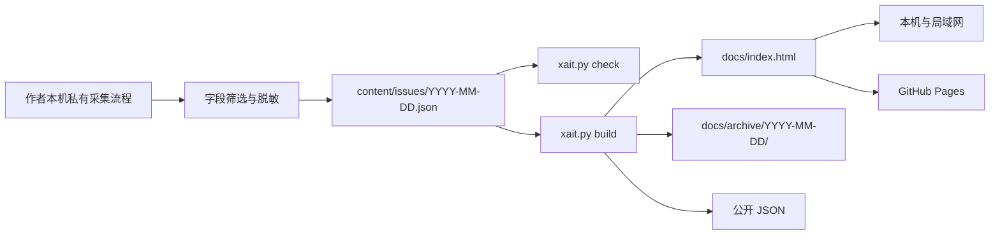

<div align="center">

# xAIT 今日

### 每日 AI 资讯｜中文平台热榜｜可离线部署

把公众号、中文内容平台、开发者社区、论文与科技媒体信号，整理成一份适合快速阅读的每日 AI 简报。

[在线体验](https://nicoleyang959.github.io/xait-today/) · [本机部署](#本机部署) · [数据边界](#数据与隐私边界)

</div>


## 项目介绍

`xAIT 今日` 是一个本地优先、可公开部署的 AI 资讯仪表盘。

它将不同来源的信息整理到同一个页面中，帮助读者按照下面的顺序完成每日阅读：

1. 查看当天 AI 资讯摘要。
2. 浏览四个重点公众号的公开推文。
3. 分别查看小红书和抖音 AI 热度 Top 10。
4. 补充 GitHub、Hacker News、arXiv 和科技媒体信号。
5. 沿原始链接继续核验和深入阅读。

项目采用原生 HTML、CSS、JavaScript 和 Python 标准库，不需要前端框架、数据库、npm、Docker 或第三方 Python 包。

## 主要功能

- 每日 AI 与科技资讯摘要
- APPSO、数字生命卡兹克、智东西、花叔每日公开推文
- 小红书近 30 天 AI 热度 Top 10
- 抖音近 30 天 AI 热度 Top 10
- GitHub、Hacker News、arXiv、Techmeme 等多源信号
- 真实日期历史归档
- 可收起的日期侧栏
- 桌面端和移动端响应式布局
- 七套可切换阅读主题
- 完全离线的页面构建与本机运行
- 面向编程智能体的统一检查、构建和部署接口

### 本次更新：结构化数据与来源质量

- 页面和发布文件使用同一份公开 issue JSON，保留来源链接、采集时刻和降级状态。
- Techmeme / YC 仅保留真实文章列表，不把会议日历、分类或招聘导航当作资讯。
- Hacker News 候选限定近 30 天并筛选 AI 相关内容；缺乏可靠发布日期时明确说明，不以采集日期代替。
- 小红书、抖音仅在已采集候选内分别取 Top 10，不代表平台全站官方榜单；由内容 ID 推算的日期标为估算。
- 公众号沿用旧快照时保留原采集时间，不显示为“今日推文”；来源不足或受限时明确降级。
- 来源状态可展开查看，项目列表使用结构化表格；七套主题与移动端布局保持兼容。

作者的私有采集端使用可选 Crawl4AI 进行部分公开列表提取。采集器、运行环境及登录态**不在本仓库中**；clone 用户仍只需 Python 标准库即可构建和部署已有内容。

## 本机部署

### 环境要求

只需要：

- Git
- Python 3.9 或更高版本
- 一个现代浏览器

不需要安装任何 Python 第三方依赖。

### macOS / Linux

```bash
git clone https://github.com/nicoleyang959/xait-today.git
cd xait-today
python3 xait.py serve
```

启动成功后访问：

```text
http://127.0.0.1:8022/
```

### Windows

```powershell
git clone https://github.com/nicoleyang959/xait-today.git
cd xait-today
py -3 xait.py serve
```

启动成功后访问：

```text
http://127.0.0.1:8022/
```

`serve` 会先检查公开数据并重新构建页面，全部通过后才启动本地服务。

按 `Ctrl+C` 可停止服务。

## 局域网访问

如果需要让同一 Wi-Fi 或局域网内的其他设备访问：

```bash
python3 xait.py serve --lan
```

指定端口：

```bash
python3 xait.py serve --lan --port 8022
```

程序会显示可访问的局域网地址。

默认模式只监听 `127.0.0.1`。只有显式使用 `--lan` 时，页面才会向局域网开放。

## 检查与重新构建

只检查数据、页面结构和安全边界：

```bash
python3 xait.py check
```

从公开 JSON 重新生成首页和全部历史归档：

```bash
python3 xait.py build
```

构建过程完全离线，不会：

- 访问外部网站
- 调用数据采集器
- 读取用户主目录
- 读取浏览器或 Cookie
- 读取环境变量中的密钥
- 调用小红书或抖音登录态服务

相同输入应当生成完全一致的输出。

## 给编程智能体使用

Codex、Claude Code、Gemini CLI 或其他编程智能体 clone 仓库后，应遵循相同流程：

```bash
python3 xait.py check
python3 xait.py serve
```

智能体不需要知道项目最初在哪台电脑上生成，也不需要访问作者的私有目录。

仓库中的约定：

- `content/issues/` 是页面的规范数据来源。
- `docs/` 是生成后的静态网站。
- `outputs/` 仅保存公开研究快照，不是隐式构建输入。
- 不得猜测或调用作者的私有采集脚本。
- 不得创建虚假的当天数据或历史日期。
- 不得提交 Cookie、令牌、密码、数据库或浏览器状态。
- 使用局域网模式前应获得设备使用者授权。

更完整的智能体协作规则见 [`AGENTS.md`](AGENTS.md)。

## 项目结构

```text
xait-today/
├── xait.py                    # 检查、构建和本机运行入口
├── AGENTS.md                  # 通用智能体协作约定
├── content/
│   ├── schema/                # 公开数据结构说明
│   └── issues/
│       └── YYYY-MM-DD.json    # 每一期的规范公开数据
├── site/
│   ├── templates/             # 页面模板
│   └── assets/                # 七套主题与交互源码
├── docs/
│   ├── index.html             # 最新一期
│   ├── archive/               # 真实历史归档
│   ├── issues/                # 可公开核验的结构化数据
│   ├── assets/                # 生成后的 CSS 与 JavaScript
│   ├── history.json
│   └── health.json
├── outputs/                   # 公开研究快照
└── tests/                     # Python 标准库测试
```

## 工作原理



公开仓库只负责：

- 保存脱敏后的公开数据
- 校验数据结构
- 生成静态页面
- 提供本机和局域网访问
- 发布 GitHub Pages

登录态采集与账号相关操作不包含在公开仓库中。

## 公开数据格式

每一期使用一个自包含 JSON 文件：

```text
content/issues/YYYY-MM-DD.json
```

完整字段约束见 [`content/schema/issue-v1.schema.json`](content/schema/issue-v1.schema.json)。

主要字段包括：

```json
{
  "schemaVersion": 1,
  "date": "2026-09-03",
  "generatedAt": "2026-09-03T08:45:00+08:00",
  "title": "xAIT 今日",
  "tagline": "AI 资讯 · IT 热点 · 每日精选",
  "sections": []
}
```

页面章节只使用以下结构化类型：

- `blocks`
- `links`
- `table`
- `wechat`
- `social`

数据中不允许直接嵌入原始 HTML 或可执行代码。

## 七套阅读主题

| 主题 | 特点 |
|---|---|
| 终端 | 黑底、荧光绿、等宽字体、高信息密度 |
| 赛博 | 深色、霓虹青、科技感与轻发光 |
| 瑞士 | 冷白、钴蓝、模块网格和清晰编号 |
| 杂志 | 奶油纸、酒红、衬线字体、编辑式版面 |
| 咨询 | 海军蓝、雾灰、证据卡片和正式层级 |
| 极简 | 白色、石墨、单栏与专注阅读 |
| 纸张 | 亚麻色、棕墨、柔和阴影和慢阅读体验 |

主题选择和侧栏状态只保存在当前浏览器中。

页面使用跨平台系统字体，不依赖 Google Fonts；断网时仍可正常显示主题、内容和归档。

## 数据与隐私边界

公开仓库不会包含：

- Cookie 或浏览器存储
- 登录令牌、密码或 API 密钥
- 小红书、抖音或公众号后台数据
- 本机数据库和缓存
- 原始登录态响应
- 本机绝对路径或局域网 IP
- 不可公开核验的公众号阅读量

公众号部分只展示公开文章列表中的：

- 账号名称
- 文章标题
- 发布时间
- 文章或账号列表链接
- 来源状态

小红书与抖音分别按照各自页面可见的互动指标排序，不进行跨平台热度比较。榜单仅覆盖已采集候选；估算日期、未核验日期和快照时间会明确区分。

互动数据会随时间变化，仓库中的数值只代表对应采集时间。

## 数据刷新说明

clone 仓库后，可以直接部署和重建仓库已经包含的公开内容。

但是，clone 用户不能在零配置情况下重新采集需要登录状态的平台数据。新的每日数据仍由作者本机的私有流程采集，经脱敏后输出为公开 issue JSON。

如果某个平台登录失效、出现验证码或来源暂时不可用，页面会：

- 停止该来源的登录态采集
- 不尝试绕过验证
- 有可用快照时沿用最近一次成功快照；否则显示来源不可用，不补造内容
- 明确显示数据日期和降级状态

## GitHub Pages

公开版本：

<https://nicoleyang959.github.io/xait-today/>

GitHub Pages 使用 `main` 分支中的 `/docs` 目录。

本机构建结果和 GitHub Pages 使用相同的静态文件，因此二者应保持一致。

## 项目状态

项目仍在持续迭代，近期重点包括：

- 完善公开数据 schema
- 提升来源状态与陈旧信息展示
- 优化移动端阅读效率
- 增加构建结果的自动化测试
- 保持本机版本与 GitHub Pages 一致

## License

本项目使用 [MIT License](LICENSE)。

页面中的文章标题、摘要、品牌名称及外部内容归原作者或对应平台所有。仓库只提供信息整理、链接索引和公开快照。
