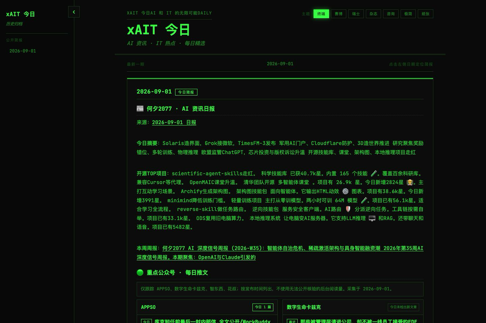
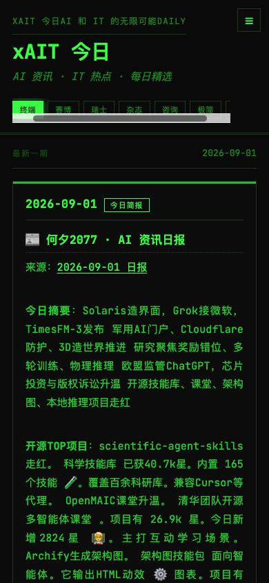
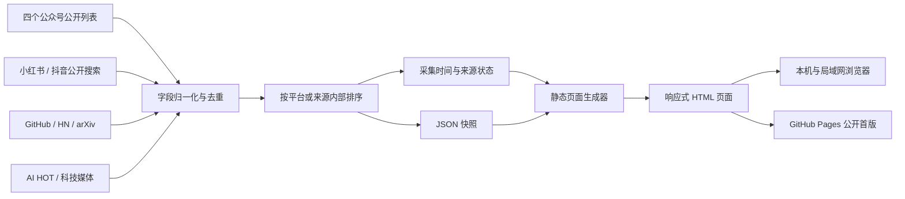

<div align="center">

<h1>xAIT 今日</h1>

<h2>每日 AI 资讯｜中文平台热榜｜七套阅读主题</h2>

<p>
<strong>先看摘要，再分平台读热榜，最后沿原始链接查证。</strong><br>
把公众号、内容平台、开发者社区、论文站和科技媒体收进同一页。
</p>

<p>
<a href="https://nicoleyang959-commits.github.io/xait-today/"><strong>在线体验</strong></a>
&nbsp;·&nbsp;
<a href="docs/">静态页面</a>
&nbsp;·&nbsp;
<a href="outputs/">公开数据快照</a>
</p>

<p>


</p>

</div>



<details>
<summary>查看移动端效果</summary>



</details>

---

## 30 秒看懂 xAIT 今日

**① 一页读完今日重点** → 先看每日摘要和重点公众号，不必在多个平台间来回切换。

**② 分平台观察中文 AI 热度** → 小红书和抖音各自排序、各取 Top 10，不把两种互动口径混成一个分数。

**③ 回到原始来源继续判断** → 每条可用内容保留来源链接；热度只负责缩小范围，事实与价值仍需人工核验。

一条清晰的阅读路径：**看摘要 → 看热榜 → 看开发者与海外信号 → 追原文**。

---

## 为什么做这个项目

AI 资讯分散在公众号、短视频平台、生活方式社区、开发者社区、论文站和科技媒体中。逐个平台查看不仅耗时，还很容易被重复内容和短期噪声淹没。

`xAIT 今日` 希望把这个过程压缩成一次阅读：先聚合近期信息，再按照来源和平台内热度整理，最后保留原始链接，让读者能够继续核验真正值得关注的内容。

它是一个信息入口，而不是事实裁判。热门内容不一定重要，热度也不直接等于行业价值或产品机会。

## 这是什么

`xAIT 今日` 是一个本地优先的 AI 与科技资讯仪表盘。公开仓库提供预生成的原生 HTML、CSS 和 JavaScript 静态页面，不依赖前端框架、后端服务或数据库；数据刷新与页面生成流程暂不包含在公开首版中。

当前页面主要包含：

- 每日 AI 资讯摘要
- 四个重点公众号的公开推文元数据
- 小红书近 30 天 AI 热度 Top 10
- 抖音近 30 天 AI 热度 Top 10
- GitHub、Hacker News、arXiv 和科技媒体信号
- 可收起的日期定位侧栏（首版公开 2026-09-01）
- 桌面端和移动端响应式布局
- 七套可切换视觉主题

## 能做什么

### 给普通读者

- 用一个页面完成当天 AI 与科技资讯扫描。
- 先读摘要，再按来源展开，避免直接面对无差别信息流。
- 在七套主题之间切换，选择适合快速浏览或长文阅读的版式。
- 在手机上默认收起日期栏，把首屏留给当天内容。

### 给内容创作者

- 从小红书和抖音的高互动内容中发现中文平台正在讨论什么。
- 用公众号、开发者社区和科技媒体补充选题背景。
- 保留作者、发布时间、互动量和原始链接，方便继续查证与深挖。
- 通过平台内排行缩小选题范围，同时避免把不同平台的数字直接比较。

### 给开发者与 Agent

- 读取结构化 JSON 快照继续做筛选、摘要、选题或可视化。
- 检查采集时间、来源状态和陈旧标记，判断数据是否适合继续使用。
- 复用静态页面架构，在不增加后端服务的情况下制作个人简报。
- 基于 `docs/` 和公开 JSON 快照继续扩展筛选、摘要或可视化能力。

### 当前功能

| 功能 | 说明 |
|---|---|
| 每日摘要 | 用较短篇幅呈现当天主要 AI 与科技动态 |
| 重点公众号 | 跟踪四个固定账号的公开标题、发布时间和链接 |
| 平台 Top 10 | 小红书与抖音分别按平台内互动量排序 |
| 多源资讯 | 补充开发者社区、论文、开源项目和科技媒体信号 |
| 来源核验 | 每条可用内容保留原始来源链接 |
| 陈旧标记 | 来源失败时沿用最近成功快照，并显示采集日期或陈旧状态 |
| 主题切换 | 提供七套布局与视觉系统，选择保存在当前浏览器中 |
| 响应式阅读 | 支持桌面、平板和手机，移动端日期栏默认收起 |

## 一次阅读怎么走

建议按照下面的顺序使用页面：

1. 阅读今日摘要，快速了解当天主要变化。
2. 查看四个重点公众号当天发布了什么。
3. 分别查看小红书和抖音 Top 10，寻找中文内容平台上的高互动话题。
4. 浏览 GitHub、Hacker News、arXiv 和科技媒体，补充开发者与海外信号。
5. 打开原始来源，对重要信息做二次核验。

## 信息来源

### 重点公众号

当前只跟踪：

- APPSO
- 数字生命卡兹克
- 智东西
- 花叔

采集器只读取公开文章列表中的账号名、标题、相对发布时间和文章或列表链接，不采集正文，不读取公众号后台，也不使用无法公开核验的阅读量。

如果某个公开来源暂时不可用，页面会沿用最近一次成功快照，并明确标记来源状态。

### 小红书与抖音

当前社交热点快照遵循以下规则：

- 主题限定为 AI、人工智能及相关内容。
- 时间范围限定为近 30 天。
- 小红书与抖音分别按各自页面提供的互动指标排序。
- 按内容 ID 或来源链接去重，每个平台最多展示 Top 10。
- 不对两个平台的热度数值做横向比较。
- 全程只读，不发布、不评论、不点赞、不收藏。
- 不导出或保存用户浏览器中的 Cookie、令牌、密码和浏览器存储内容。

互动量会继续变化，因此仓库快照中的数值只代表采集时刻。

更详细的方法说明见：[小红书与抖音 AI 热点采集方案](outputs/小红书与抖音AI热点采集方案.md)。

### 综合资讯与开发者信号

页面还会根据来源的可用状态读取或抓取：

- 何夕2077
- AI HOT
- GitHub Trending 与 GitHub Search
- Techmeme
- Hacker News
- arXiv
- Bluesky
- StockTwits
- Product Hunt
- Y Combinator 官方博客
- `last30days` 可用的公开社区与平台信号

外部站点可能发生限流、结构变化或临时不可用，因此并非每次更新都能完整覆盖全部来源。

## 排序原则

不同平台的互动机制和统计口径并不相同，因此项目只做平台内部排序：

| 平台或来源 | 主要排序信号 |
|---|---|
| 小红书 | 页面可见的点赞、评论、收藏等互动数据 |
| 抖音 | 页面可见点赞数等互动数据 |
| GitHub | Stars、当日新增 Stars、Forks |
| Hacker News | Points 与评论数 |
| 其他来源 | 来源互动数据或 `last30days` 相关度 |

这些指标用于控制阅读顺序，不是跨平台统一分数，也不代表内容真实性。

## 工作原理



生成过程使用完整文件写入后替换的方式发布 HTML 和 JSON，避免浏览器读到只写了一部分的文件。

## 七套主题

主题不仅改变颜色，也会改变字体、版心、卡片组织和信息密度。

| 主题 | 视觉特征 | 适合场景 |
|---|---|---|
| 终端 | 黑底、荧光绿、等宽字体、高密度 | 实时值守与快速扫描 |
| 赛博 | 深黑、霓虹青、轻发光 | 科技展示与夜间浏览 |
| 瑞士 | 冷白、钴蓝、信号红、模块网格 | 高效率信息阅读 |
| 杂志 | 奶油纸、酒红、衬线字体、错落卡片 | 编辑精选与深度阅读 |
| 咨询 | 海军蓝、雾灰、铜金、证据卡片 | 管理层简报与正式汇报 |
| 极简 | 白色、石墨、电光紫、单栏阅读 | 专注阅读与移动端 |
| 纸张 | 亚麻色、棕墨、鼠尾草绿、柔和阴影 | 慢阅读与周末阅读 |

主题选择和日期栏状态保存在当前浏览器的 `localStorage` 中，不会自动跨设备同步。

## 快速开始（查看静态快照）

### 前置条件

- Python 3.9 或更高版本
- 一个现代浏览器

Fork 或克隆仓库后，在项目根目录运行：

```bash
python3 -m http.server 8022 --directory docs
```

然后打开：

```text
http://127.0.0.1:8022/
```

`docs/` 是 GitHub Pages 使用的公开静态版本，不需要安装额外依赖即可查看。也可以直接访问[在线页面](https://nicoleyang959-commits.github.io/xait-today/)。

## 公开首版的范围

当前仓库提供可直接浏览的静态页面、公开数据快照和采集方案。为了避免提交登录凭据、浏览器状态和本机环境配置，完整刷新链路仍保留在本地，包括：

- 公众号公开列表采集器
- `last30days` Skill 与 Python 3.12 运行时
- 小红书本地只读服务
- 已登录抖音的浏览器读取流程
- 综合资讯采集器
- 静态仪表盘生成器

因此，Fork 或克隆仓库后可以直接查看首版快照，但还不能一键生成当天的完整简报。把这些组件整理为可安装、可配置且不依赖个人登录态的脚本，是下一阶段的主要工作。

## 数据产物

### 社交热点快照

路径格式：

```text
outputs/social-ai-hotspots-YYYY-MM-DD.json
```

主要字段：

| 字段 | 说明 |
|---|---|
| `platform` | 平台，目前主要为 `xiaohongshu` 或 `douyin` |
| `title` | 内容标题或页面可见文本 |
| `author` | 作者或账号名 |
| `published` | 来源可核验的发布时间 |
| `engagement` | 采集时的平台互动量 |
| `engagementLabel` | 页面展示用的互动说明 |
| `topic` | 检索主题 |
| `url` | 原始来源链接 |

示例：[2026-09-01 社交热点快照](outputs/social-ai-hotspots-2026-09-01.json)。

### 公众号快照

路径格式：

```text
docs/wechat-daily-YYYY-MM-DD.json
docs/wechat-daily.json
```

每个账号保存：

- 账号名称
- 来源状态
- 当日文章数量
- 标题
- 相对发布时间与换算日期
- 文章链接或公开列表链接
- 是否为当天发布

示例：[2026-09-01 公众号快照](docs/wechat-daily-2026-09-01.json)。

`docs/social-research.json`、`docs/wechat-daily*.json` 和 `docs/history.json` 是在线页面随版本发布的公开配套数据；作者名均为来源页面公开显示名，数值只代表文件中的采集时刻。

## 项目结构

```text
.
├── .gitignore
├── LICENSE
├── README.md
├── assets/
│   └── screenshots/
│       ├── xait-today-desktop.png
│       └── xait-today-mobile.png
├── docs/
│   ├── .nojekyll
│   ├── index.html
│   ├── history.json
│   ├── social-research.json
│   └── wechat-daily*.json
├── outputs/
│   ├── social-ai-hotspots-YYYY-MM-DD.json
│   └── 小红书与抖音AI热点采集方案.md
```

目录说明：

| 目录 | 用途 |
|---|---|
| `docs/` | GitHub Pages 使用的静态页面与公开配套数据 |
| `outputs/` | 可核验、可继续处理的数据快照与采集方案 |
| `assets/screenshots/` | README 使用的最新版桌面端与移动端截图 |

原始数据库、翻译缓存、浏览器状态和采集过程中的中间文件不会进入仓库。

## 版本状态与路线图

已经完成：

- [x] 单页 AI 与科技资讯仪表盘
- [x] 四个重点公众号公开推文快照
- [x] 小红书和抖音近 30 天 Top 10 快照
- [x] 多个科技、开发者和论文公开来源
- [x] 七套可持久化主题
- [x] 可收起的日期定位侧栏
- [x] 桌面端与 390px 手机端适配
- [x] 来源链接、采集时间和陈旧状态展示
- [x] 脱敏数据与采集方法说明
- [x] GitHub Pages 在线公开首版
- [x] 桌面端与移动端产品截图
- [x] MIT 开源许可证

仍需完善：

- [ ] 将采集器和页面生成器迁入仓库
- [ ] 提供统一配置文件和一条命令完成刷新
- [ ] 为各数据源增加结构校验与健康检查
- [ ] 让历史日期加载对应日期的完整简报正文
- [ ] 增加自动化测试与 CI
- [ ] 提供不依赖个人登录态的自动部署与定时更新方案

## 数据与使用边界

- “最新”以来源发布时间和最近一次成功采集时间为准。
- 平台热度只能在同一平台内部比较。
- 热度、摘要、分类和自动翻译都可能存在误差。
- 重要信息需要回到原始来源核验。
- 外部来源不可用时，快照可能暂时沿用最近一次成功结果。
- 社交平台采集保持只读，不执行发布、评论、点赞或收藏操作。
- 项目不读取、导出、打印或提交用户浏览器中的 Cookie、令牌、密码及浏览器存储内容。
- 仓库中的数据是历史快照，不能当作持续更新中的实时数据。

## 给 Agent 的接手说明

如果你想让 Codex、Claude Code 或其他编程 Agent 继续把这个原型整理成可 Fork、可自动更新的公开项目，可以直接提供下面这段任务说明：

```text
请先阅读 README.md、outputs/ 下的数据快照和采集方案，再检查仓库的实际文件结构。
目标是把当前本地原型整理成自包含项目：将采集器和页面生成器迁入仓库，
提供统一配置、可重复执行的刷新命令、数据校验和静态部署方案。
保留公开来源链接与陈旧状态；不要把 Cookie、令牌、密码、浏览器存储或私有数据写入仓库。
任何新增来源都要先说明访问方式、数据边界、失败降级和长期维护成本。
```

## 贡献

欢迎通过 Issue 提交：

- 新的公开 AI 资讯来源
- 失效链接或采集结构变化
- 更合理的平台内排序方式
- 页面可读性和响应式问题
- 数据字段与来源状态改进建议

提交来源建议时，请附上公开链接、来源类型以及它为什么值得长期关注。

## 致谢

- [AI News Radar](https://github.com/LearnPrompt/ai-news-radar)：README 的信息组织与读者路径参考。
- AI HOT、GitHub、Hacker News、arXiv 以及其他公开来源：为每日简报提供可核验信号。
- `last30days`：为近期公开平台与社区研究提供统一入口。

## License

本项目代码以 [MIT License](LICENSE) 发布。第三方文章标题、摘要、链接和平台数据仍分别属于其原始权利人及来源平台；仓库只提供聚合展示与来源索引。
