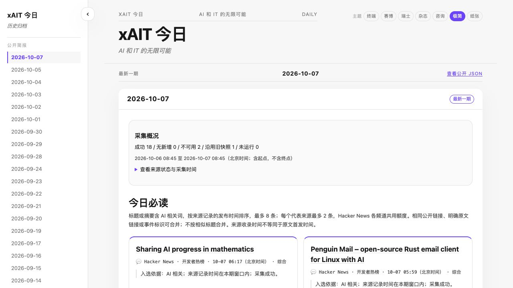
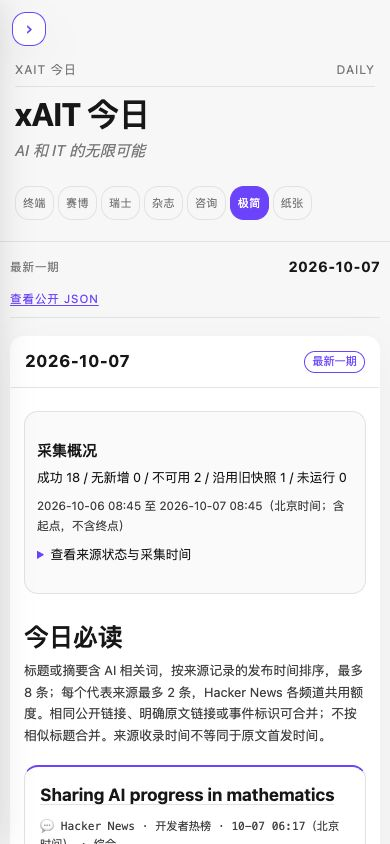
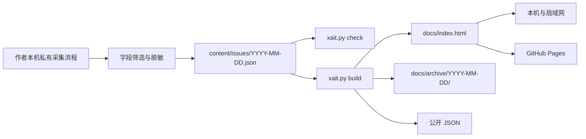

<div align="center">

# xAIT 今日

### 今日必读｜原文可追溯｜可离线部署

把公众号、中文内容平台、开发者社区、论文与科技媒体的公开信号，整理成一份带来源状态、可继续核验的每日 AI 简报。

[在线体验](https://nicoleyang959.github.io/xait-today/) · [本机部署](#本机部署) · [数据边界](#数据与隐私边界)

</div>



<details>
<summary>查看移动端效果</summary>



</details>

## 项目介绍

`xAIT 今日` 是一个本地优先、可公开部署的 AI 资讯仪表盘。

它将不同来源的信息整理到同一个页面中，帮助读者按照下面的顺序完成每日阅读：

1. 查看采集概况，确认本期时间窗口与来源是否有效。
2. 阅读「今日必读」：从合格候选中最多选出 8 条事件，不为凑数补足。
3. 查看入选理由、来源及时间；同一事件的相关链接可展开核验。
4. 按来源继续阅读公众号、中文平台、GitHub、Hacker News、arXiv 和科技媒体条目。
5. 沿原始链接深入阅读，或通过历史侧栏查看真实日期的往期快照。

以上阅读层适用于 v2 issue；已有 v1 历史 issue 保持原有内容与按来源阅读方式。

项目采用原生 HTML、CSS、JavaScript 和 Python 标准库，不需要前端框架、数据库、npm、Docker 或第三方 Python 包。

## 主要功能

- 带来源与入选理由的「今日必读」，最多 8 条
- 统一的北京时间日窗口与可展开的来源状态
- APPSO、数字生命卡兹克、智东西、花叔每日公开推文
- 小红书近 30 天 AI 热度 Top 10
- 抖音近 30 天 AI 热度 Top 10
- GitHub、Hacker News、arXiv、Techmeme 等多源信号
- 真实日期历史归档
- 可收起的日期侧栏
- 桌面端和移动端响应式布局
- 七套可切换阅读主题
- 完全离线的页面构建与本机运行
- 面向编程智能体的统一检查、构建和部署接口

### 本次更新：编辑阅读层与 v2 兼容

- 同时支持 v1 与 v2 issue。v1 历史数据无需迁移，v2 在原来源章节前增加采集概况和「今日必读」。
- 每一期的精选窗口为北京时间前一天 08:45 至当日 08:45，共 24 小时，采用左闭右开区间 `[start, end)`。发布时间与采集时间分别记录，不用采集时间冒充发布时间。
- 精选只使用已提供的公开证据；合格事件不足 8 条时按实际数量展示，没有合格事件时说明原因。不调用 LLM 生成事实、补写新闻或补造摘要。
- 通过规范化 URL、明确的 `originalUrl` 与 `eventKey` 保守归并同一事件，并保留相关链接；不会把标题相似自动认定为同一事件。
- 采集时间、最近成功时间、条数与失败说明可展开查看。旧快照保留原时间和状态；没有有效数据的平台保留简洁的空状态与采集说明。
- 七套主题、浏览器主题记忆、历史侧栏和移动端阅读保持兼容。页面使用原生 `details` 展开信息，阅读不依赖联网。

原来源章节仍遵守各自的范围：小红书、抖音仅在已采集候选内分别取近 30 天 Top 10，不代表平台全站官方榜单；这类榜单的时间范围不等于「今日必读」的 24 小时窗口。由内容 ID 推算的日期标为估算，缺乏可靠发布日期时明确说明。Techmeme / YC 只保留真实文章列表，导航、招聘或会议日历不作为资讯。

作者的私有采集端使用可选 Crawl4AI 进行部分公开列表提取。采集器、运行环境及登录态**不在本仓库中**；clone 用户仍只需 Python 标准库即可构建和部署已有内容。

## 本机部署

### 环境要求

只需要：

- Git
- Python 3.9 或更高版本
- 一个现代浏览器

不需要安装任何 Python 第三方依赖。

### macOS / Linux

```bash
git clone https://github.com/nicoleyang959/xait-today.git
cd xait-today
python3 xait.py serve
```

启动成功后访问：

```text
http://127.0.0.1:8022/
```

### Windows

```powershell
git clone https://github.com/nicoleyang959/xait-today.git
cd xait-today
py -3 xait.py serve
```

启动成功后访问：

```text
http://127.0.0.1:8022/
```

`serve` 会先检查公开数据并重新构建页面，全部通过后才启动本地服务。

按 `Ctrl+C` 可停止服务。

## 局域网访问

如果需要让同一 Wi-Fi 或局域网内的其他设备访问：

```bash
python3 xait.py serve --lan
```

指定端口：

```bash
python3 xait.py serve --lan --port 8022
```

程序会显示可访问的局域网地址。

默认模式只监听 `127.0.0.1`。只有显式使用 `--lan` 时，页面才会向局域网开放。

## 检查与重新构建

只检查数据、页面结构和安全边界：

```bash
python3 xait.py check
```

从公开 JSON 重新生成首页和全部历史归档：

```bash
python3 xait.py build
```

构建过程完全离线，不会：

- 访问外部网站
- 调用数据采集器
- 读取用户主目录
- 读取浏览器或 Cookie
- 读取环境变量中的密钥
- 调用小红书或抖音登录态服务

相同输入应当生成完全一致的输出。

## 给编程智能体使用

Codex、Claude Code、Gemini CLI 或其他编程智能体 clone 仓库后，应遵循相同流程：

```bash
python3 xait.py check
python3 xait.py serve
```

智能体不需要知道项目最初在哪台电脑上生成，也不需要访问作者的私有目录。

仓库中的约定：

- `content/issues/` 是页面的规范数据来源。
- `docs/` 是生成后的静态网站。
- `outputs/` 仅保存公开研究快照，不是隐式构建输入。
- 不得猜测或调用作者的私有采集脚本。
- 不得创建虚假的当天数据或历史日期。
- 不得提交 Cookie、令牌、密码、数据库或浏览器状态。
- 使用局域网模式前应获得设备使用者授权。

更完整的智能体协作规则见 [`AGENTS.md`](AGENTS.md)。

## 项目结构

```text
xait-today/
├── xait.py                    # 检查、构建和本机运行入口
├── AGENTS.md                  # 通用智能体协作约定
├── content/
│   ├── schema/                # 公开数据结构说明
│   └── issues/
│       └── YYYY-MM-DD.json    # 每一期的规范公开数据
├── site/
│   ├── templates/             # 页面模板
│   └── assets/                # 七套主题与交互源码
├── docs/
│   ├── index.html             # 最新一期
│   ├── archive/               # 真实历史归档
│   ├── issues/                # 可公开核验的结构化数据
│   ├── assets/                # 生成后的 CSS 与 JavaScript
│   ├── history.json
│   └── health.json
├── outputs/                   # 公开研究快照
└── tests/                     # Python 标准库测试
```

## 工作原理


```mermaid
flowchart LR
    private["作者本机私有采集流程"] --> sanitize["字段筛选与脱敏"]
    sanitize --> issue["content/issues/YYYY-MM-DD.json"]

    issue --> check["xait.py check"]
    issue --> build["xait.py build"]

    build --> latest["docs/index.html"]
    build --> archive["docs/archive/YYYY-MM-DD/"]
    build --> publicjson["公开 JSON"]

    latest --> local["本机与局域网"]
    latest --> pages["GitHub Pages"]
```

公开仓库只负责：

- 保存脱敏后的公开数据
- 校验数据结构
- 生成静态页面
- 提供本机和局域网访问
- 发布 GitHub Pages

登录态采集与账号相关操作不包含在公开仓库中。

## 公开数据格式

每一期使用一个自包含 JSON 文件：

```text
content/issues/YYYY-MM-DD.json
```

字段约束见 [v1 schema](content/schema/issue-v1.schema.json) 与 [v2 schema](content/schema/issue-v2.schema.json)。v2 扩展公开来源记录与可追溯条目，由离线构建生成编辑阅读层；不改变 v1 历史 issue 的格式。

兼容的 v1 基本结构如下：

```json
{
  "schemaVersion": 1,
  "date": "2026-09-03",
  "generatedAt": "2026-09-03T08:45:00+08:00",
  "title": "xAIT 今日",
  "tagline": "AI 资讯 · IT 热点 · 每日精选",
  "sections": []
}
```

v2 将 `schemaVersion` 设为 `2`，保留这些基本字段与 `sections`，另增加：

- `edition`：本期的 `windowStart` 与 `windowEnd`。
- `sources`：来源标识、显示名称、状态、检查时间、最近成功时间、条数与说明。
- `articles`：条目标识、所属来源、标题、原文 URL、发布时间证据、采集时间与分类；可选 `originalUrl`、`eventKey` 和有依据的 `summary`。

`dateEvidence` 区分带时区的准确时间（`exact`）、仅知道日期（`day`）与未知时间（`unknown`）；未知发布时间使用 `null`。来源章节可以保留时间证据不完整的条目，并明确显示状态；「今日必读」依据校验后的时间与来源条件筛选。精选及其相关链接由构建推导，不需要在 JSON 中维护第二份精选列表。

两种版本的原来源章节继续使用以下结构化类型：

- `blocks`
- `links`
- `table`
- `wechat`
- `social`

数据中不允许直接嵌入原始 HTML 或可执行代码。

## 七套阅读主题

| 主题 | 特点 |
|---|---|
| 终端 | 黑底、荧光绿、等宽字体、高信息密度 |
| 赛博 | 深色、霓虹青、科技感与轻发光 |
| 瑞士 | 冷白、钴蓝、模块网格和清晰编号 |
| 杂志 | 奶油纸、酒红、衬线字体、编辑式版面 |
| 咨询 | 海军蓝、雾灰、证据卡片和正式层级 |
| 极简 | 白色、石墨、单栏与专注阅读 |
| 纸张 | 亚麻色、棕墨、柔和阴影和慢阅读体验 |

主题选择和侧栏状态只保存在当前浏览器中，沿用现有偏好存储键。收起侧栏后，其历史链接不占用键盘焦点；页面顶部提供跳到正文的入口。

页面使用跨平台系统字体，不依赖 Google Fonts；断网时仍可正常显示主题、内容和归档。

## 数据与隐私边界

公开仓库不会包含：

- Cookie 或浏览器存储
- 登录令牌、密码或 API 密钥
- 小红书、抖音或公众号后台数据
- 本机数据库和缓存
- 原始登录态响应
- 本机绝对路径或局域网 IP
- 不可公开核验的公众号阅读量

公众号部分只展示公开文章列表中的：

- 账号名称
- 文章标题
- 发布时间
- 文章或账号列表链接
- 来源状态

小红书与抖音分别按照各自页面可见的互动指标排序，不进行跨平台热度比较。榜单仅覆盖已采集候选；估算日期、未核验日期和快照时间会明确区分。

互动数据会随时间变化，仓库中的数值只代表对应采集时间。

本次升级只调整公开 issue 的校验、归并和阅读展示，不连接 AIHOT，不同步其新数据，也不扩展私有采集器。构建和浏览不会调用模型或外部数据 API。

## 数据刷新说明

clone 仓库后，可以直接部署和重建仓库已经包含的公开内容。

但是，clone 用户不能在零配置情况下重新采集需要登录状态的平台数据。新的每日数据仍由作者本机的私有流程采集，经脱敏后输出为公开 issue JSON。

如果某个平台登录失效、出现验证码或来源暂时不可用，页面会：

- 停止该来源的登录态采集
- 不尝试绕过验证
- 有可用快照时沿用最近一次成功快照；否则显示来源不可用，不补造内容
- 明确显示数据日期和降级状态

## GitHub Pages

公开版本：

<https://nicoleyang959.github.io/xait-today/>

GitHub Pages 使用 `main` 分支中的 `/docs` 目录。

本机构建结果和 GitHub Pages 使用相同的静态文件，因此二者应保持一致。

## 项目状态

项目仍在持续迭代，近期重点包括：

- 保持 v1 历史数据与 v2 编辑阅读层兼容
- 提升公开证据、来源状态与陈旧信息的可读性
- 优化移动端阅读效率
- 维护离线、确定性构建与安全边界检查
- 保持本机版本与 GitHub Pages 一致

## License

本项目使用 [MIT License](LICENSE)。

页面中的文章标题、摘要、品牌名称及外部内容归原作者或对应平台所有。仓库只提供信息整理、链接索引和公开快照。
